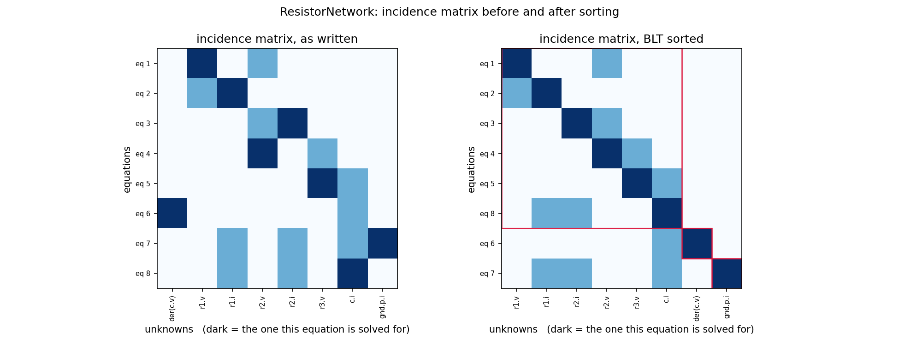
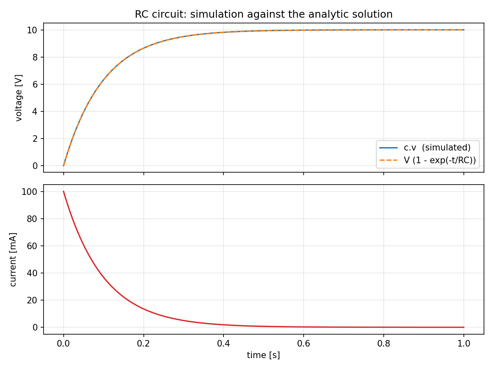

# TinySim

A tiny equation-based, **acausal** modeling language and simulator, written to
be read.

TinySim is a small subset of [Modelica](https://modelica.org), with the same
syntax and the same semantics, implemented in under 4000 lines of
heavily commented Python. It is not fast and it is not complete. Its purpose is that **every step
from model text to simulation result can be printed and inspected**: the
flattened equations, what `connect` generated, which equation was chosen to
compute which unknown, the order they are solved in, the Python code that gets
generated, and how events are handled.

```modelica
model RCCircuit
  ConstantVoltage src(V = 10);
  Resistor        r(R = 100);
  Capacitor       c(C = 1e-3, v(start = 0));
  Ground          gnd;
equation
  connect(src.p, r.p);
  connect(r.n, c.p);
  connect(c.n, src.n);
  connect(src.n, gnd.p);
end RCCircuit;
```

Nothing in that model says what depends on what. TinySim turns it into 20 flat
equations, reduces them to 4, sorts them, and generates this:

```python
    # ---- block 1: solve for r.v  [explicit]
    #        r.v = src.V - c.v
    r__v = -c__v + src__V

    # ---- block 2: solve for c.i  [explicit]
    #        r.v = r.R * c.i
    c__i = r__v/r__R

    # ---- block 3: solve for der(c.v)  [explicit]
    #        c.C * der(c.v) = c.i
    der_c__v = c__i/c__C
```

The sorted incidence matrix is the picture worth keeping: dark cells are the
unknown each equation was chosen to compute, the red outline is an algebraic
loop, and nothing above the diagonal means the blocks can be solved from the
top down.



## Install

```bash
python -m venv .venv
.venv/bin/pip install -e .          # numpy, scipy, sympy, matplotlib
.venv/bin/pip install pytest        # to run the tests
```

## Use it

From Python -- the model file describes the system, the script decides what to
do with it:

```python
import tinysim

model = tinysim.load("examples/electrical.tiny", "RCCircuit")
tinysim.explain(model)                       # every stage of the pipeline
result = tinysim.simulate(model, stop=1.0)
tinysim.plot(result, ["c.v", "r.i"])
```

From the command line:

```bash
tinysim show  examples/electrical.tiny                 # the whole pipeline
tinysim show  examples/dcmotor.tiny --stages flat,blt,code
tinysim check examples/pendulum_cartesian.tiny         # analyse only
tinysim run   examples/bouncing_ball.tiny --stop 3 --plot h,v
```



## What it covers

| Idea | Where to see it |
| --- | --- |
| Acausal composition: `connect` becomes Kirchhoff's laws | `examples/electrical.tiny` |
| The same rules in two physical domains at once | `examples/dcmotor.tiny` |
| Flattening, alias elimination, matching, BLT sorting | `tinysim show ... --stages flat,alias,matching,blt` |
| Linear algebraic loops, solved as a matrix equation | `examples/resistor_network.tiny` |
| Nonlinear algebraic loops, solved by iteration | `examples/diode_circuit.tiny` |
| Initialization as a system of its own | `examples/tank.tiny` |
| Events, state jumps, discrete variables | `examples/bouncing_ball.tiny`, `examples/thermostat.tiny` |
| High index detected and explained, not solved | `examples/pendulum_cartesian.tiny` |

## Read it in this order

1. [`docs/language.md`](docs/language.md) -- the language, with a grammar.
2. [`docs/pipeline.md`](docs/pipeline.md) -- one circuit followed through every
   stage, with the real output at each one. **Start here if you only read one.**
3. [`experiments/`](experiments) -- six runnable scripts, each teaching one
   idea and producing one figure:

   ```bash
   .venv/bin/python experiments/01_rc_pipeline.py          # the pipeline, end to end
   .venv/bin/python experiments/02_structure_and_sorting.py # incidence matrices, drawn
   .venv/bin/python experiments/03_hybrid_events.py         # events and state jumps
   .venv/bin/python experiments/04_initialization.py        # steady-state start-up
   .venv/bin/python experiments/05_when_it_does_not_work.py # the error messages
   .venv/bin/python experiments/06_dc_motor.py              # two domains, one rule
   ```

4. The source, in pipeline order: `lexer.py`, `parser.py`, `flatten.py`,
   `alias.py`, `analysis.py`, `codegen.py`, `simulator.py`.

## What it deliberately does not do

One scalar type (`Real`), no arrays, no records, no `algorithm` sections, no
user-defined functions, no packages, no tearing of algebraic loops, and **no
index reduction**: a high-index model is detected and explained, with a
description of what Pantelides' algorithm would do about it, rather than
quietly repaired. Leaving these out is what keeps the implementation readable;
saying so out loud is what keeps it honest.

## Tests

```bash
.venv/bin/python -m pytest tests/ -q
```

The tests check against results worked out by hand -- `V(1 - exp(-t/RC))`,
conservation of energy, `2*pi*sqrt(L/g)`, `sqrt(2h/g)`, `V*k/(k^2 + R*d)` --
not against whatever the code currently prints.

## Built with Claude Code

This repository is also a worked example of building a project of this size
with an AI coding agent: see
[`docs/building-with-claude.md`](docs/building-with-claude.md), the reusable
prompts in [`prompts/`](prompts), and the review subagents in
[`.claude/agents/`](.claude/agents).

## Licence

MIT.
